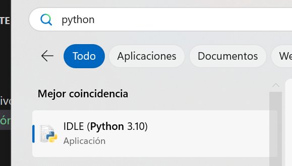
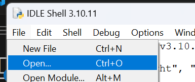
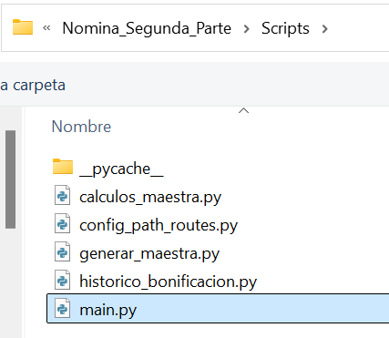
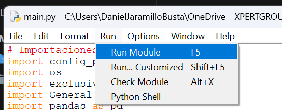
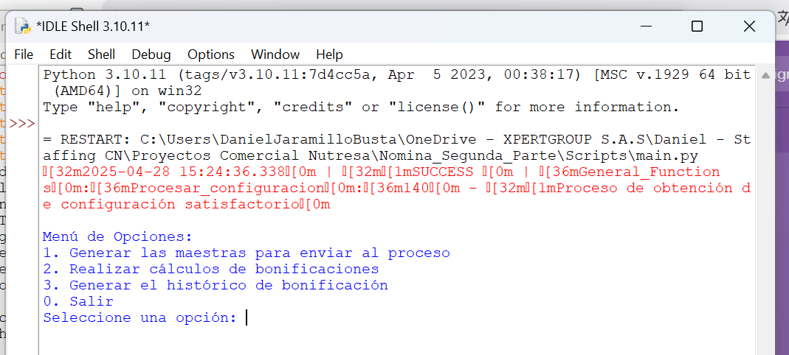
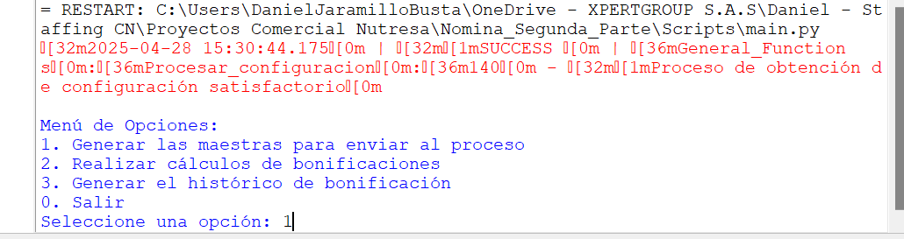
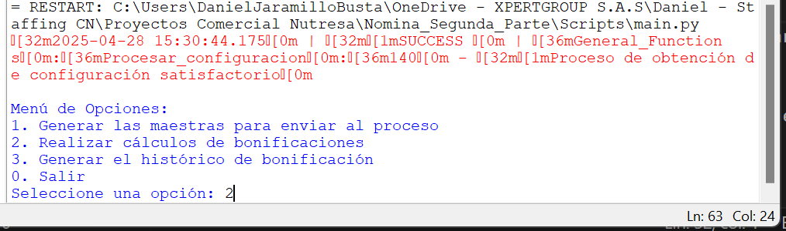
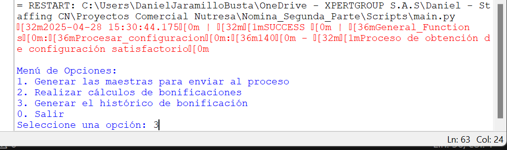

# 🚀 Ejecución del Proceso de Nómina Variable Logística

## 📑 Tabla de Contenido
1. 🐍 Ingreso al entorno IDLE de Python
2. 📂 Apertura del archivo principal `main.py`
3. ⚡ Ejecución del proceso y selección de opciones
4. 📌 Notas importantes

---

## 🐍 1. Ingreso al Entorno IDLE de Python

Para ejecutar la automatización en cualquiera de las 3 partes, se sigue **el mismo proceso**, independientemente de la opción seleccionada.

**Pasos:**

1. Ingresar al IDLE de Python:
   - Buscamos y abrimos **Python IDLE**.

   

---

## 📂 2. Apertura del Archivo Principal `main.py`

2. Abrimos el archivo principal del proyecto:

   - En la parte superior seleccionamos `Archivo` o `File`, y luego hacemos clic en `Open`.

   

   - Se abrirá el explorador de archivos. Allí buscamos la **carpeta del proyecto**.
   - Entramos a la carpeta `Scripts` y seleccionamos el archivo `main.py`.

   

✅ Se abrirá una nueva ventana.  
En la parte superior vamos a `Run > Run Module`, y así iniciará la ejecución del proceso.

> **⚠️ Advertencia:**  
> No debemos modificar nada en esta ventana, solo ejecutarla como se indica.

](Img/run_module.png)

---

## ⚡ 3. Ejecución del proceso y Selección de Opciones

3. El proceso iniciará de inmediato, desplegando una nueva ventana que mostrará un **menú de opciones**.  
Debemos ingresar el número correspondiente a la opción que queremos correr.

---

### Opciones del Menú

1️⃣ **Opción 1:**  
Generar el archivo de **Ingresos y Retiros**, que se guarda automáticamente en la carpeta `/Insumos` (⚠️ No debemos modificarlo).  
Además, se genera el archivo `Maestra_para_procesos.xlsx` en la carpeta `/Resultados`.

   

2️⃣ **Opción 2:**  
Generar la **base de pago**.  
Previamente, debes haber suministrado el insumo `Maestra_post_proceso.xlsx` en la carpeta `/Insumos` (producto de enviar el archivo generado en la opción 1 a la dependencia correspondiente en Comercial Nutresa para su diligenciamiento, y luego devolverlo).

   

3️⃣ **Opción 3:**  
Generar el **histórico de pago**.  
Este se guarda automáticamente en la carpeta `/Resultados/` como `Historico_para_pago.xlsx`.

   

---

✅ Luego de digitar el número de la opción deseada, **solo debemos presionar `Enter`**, y el proceso iniciará automáticamente.

---

## 📌 Notas importantes

- Es absolutamente indispensable contar con los **insumos correspondientes** para cada parte del proceso.  
  Se deben respetar estrictamente los **nombres de archivos**, **hojas internas** y **ubicaciones dentro de las carpetas** del proyecto.

- Se puede consultar el **video explicativo** entregado junto con esta automatización para revisar en detalle la ejecución de cada paso. Por temas de almacenamiento el video no es adjunto al repositorio.

---
