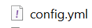
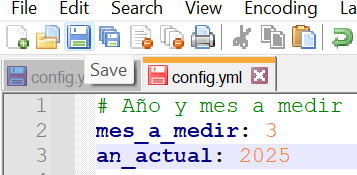
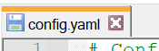
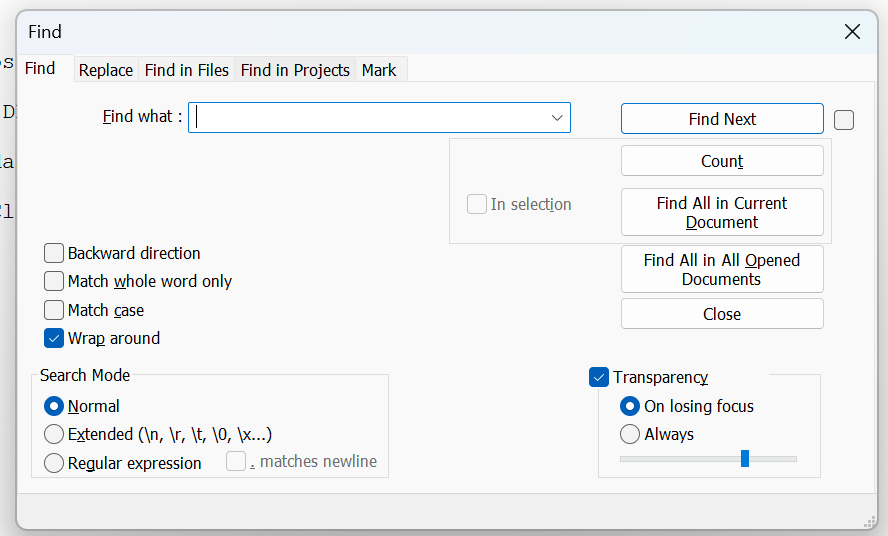
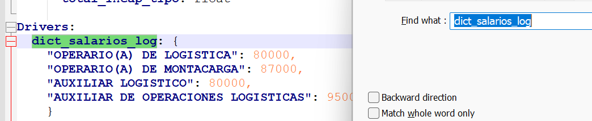
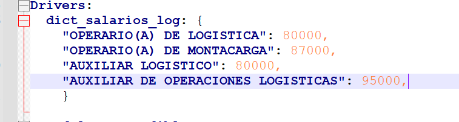
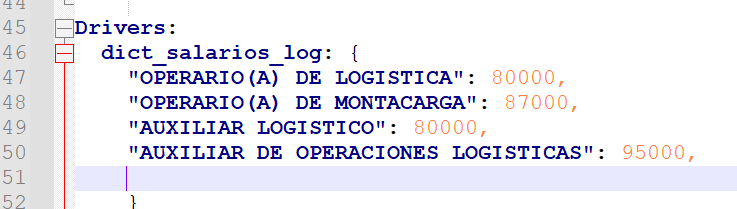
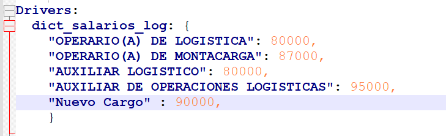
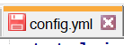

# Proyecto de Nómina Variable Logística

## 📑 Tabla de Contenido

1. Insumos Diferentes Partes
   - Parte 1
     - Maestras de Personal
       - Maestra de Vinculados
       - Maestra de Temporales
   - Parte 2
     - Maestra de Ingresos y Retiros
     - Maestra para Enviar al Proceso
2. Actualización del Archivo `config.yml`


---

## Insumos Diferentes Partes

### Parte 1

#### Maestras de Personal

📂 Archivos Excel básicos, sin macros y con la extensión `.xlsx`. Contienen todo el personal medible para la bonificación logística. Se dividen en dos subgrupos: **temporales** y **vinculados**.

**Maestra de Vinculados**  
- **📄 Archivo:** `Maestra Vinculados.xlsx`
- **📋 Hojas necesarias:**  
  - Activos
  - Ingresos
  - Licen no remun variab
  - Vacac cargos espec Logist
  - Incap cargos espec Logist

**Maestra de Temporales**  
- **📄 Archivo:** `Maestra Temporales.xlsx`
- **📋 Hoja necesaria:** `Maestra Acumulada`

📌 Los archivos anteriores no contienen macros. Para conocer su estructura y composición, se debe revisar el archivo **Estructura_archivos1.xlsx** que se encuentra en la carpeta de documentación del proyecto.

### Parte 2

#### Maestra de Ingresos y Retiros

📁 Luego de la ejecución de la primera parte, dentro de la carpeta `/Insumos`, se encontrará el nuevo archivo de insumo `Maestra_ingresos_ret.xlsx`, que es a la vez resultado de la ejecución de la Parte 1 e insumo para la ejecución de la Parte 2.

#### Maestra para Enviar al Proceso

📂 Seguidamente, en la carpeta `/Resultados`, se encontrará el archivo `Maestras_para_procesos.xlsx`. Este archivo debe ser manejado por el especialista de nómina de Comercial Nutresa.

📌 Se debe enviar al proceso correspondiente (definido internamente dentro de la compañía Comercial Nutresa) y solicitar el diligenciamiento de las columnas originalmente en blanco:

- META EGL
- % META CONFIABILIDAD
- RESULTADO EGL
- % CONFIABILIDAD

📁 Posteriormente, el archivo diligenciado debe ser renombrado como `Maestra_post_proceso.xlsx` y depositado dentro de la carpeta `/Insumos` para ejecutar la segunda parte del proceso.

---

## Actualización del Archivo `config.yml`

🔧 El archivo `config.yml` es crucial para definir parámetros y valores necesarios para la ejecución del proceso. Cada vez que se corra el proceso, el usuario debe actualizar el mes y el año según el mes para el cual hará el pago, así como los valores de la bonificación y los cargos. Aquí tienes un paso a paso muy simple de cómo hacerlo:

1. **Abrir el archivo `config.yml`:** Utiliza el editor de texto **Notepad++** para abrir el archivo `config.yml`.

2. **Localizar las variables del mes y año:** Busca las líneas donde se definen las variables del mes (`mes`) y del año (`año`). Estas líneas suelen estar al principio del archivo bajo los nombres `mes_a_medir` y `an_actual`.

3. **Actualizar los valores del mes y año:**
   - Cambia el valor de `mes_a_medir` al número correspondiente al mes para el cual se hace el pago (por ejemplo, 1 para enero, 2 para febrero, 11 para noviembre).
   - Cambia el valor de `an_actual` al nuevo año (por ejemplo, 2025).

4. **Localizar las variables de bonificación y cargos:** Busca las líneas donde se definen los valores de la bonificación (`bonificacion`) y los cargos (`cargos`). Utilizando `Ctrl+F`, despliega la barra de búsqueda y escribe **dict_salarios_log** para localizar la sección.

5. **Actualizar los valores de bonificación y cargos:**
   - Cambia el valor de la `bonificacion` según sea necesario.
   - Cambia el valor de los `cargos` según sea necesario.

6. **Guardar cambios:** Guarda los cambios realizados en el archivo.

7. **Ejecutar el proceso:** Corre nuevamente tu proceso con la configuración actualizada.

📋 **Nota:** En caso de que los valores de cargos y bonificaciones no presenten cambios y no haya cambios de año, solo actualizaremos el valor de `mes_a_medir`.

---

Una vez verificado que los insumos de cada parte estén correctamente insertados en la carpeta `/Insumos`, procedemos a ejecutar el proceso utilizando el entorno de desarrollo **Python IDLE**.

### 1. Modificar el archivo `config.yml`

Ingresamos al programa **Notepad++**.


En la parte superior damos clic en `File` y luego en `Open`, seleccionando el archivo **config.yml** que se encuentra en la carpeta principal del proyecto.



Una vez abierto, tendremos una ventana similar a esta, donde en la parte superior veremos inmediatamente `mes_a_medir` y `an_actual`, que debemos modificar según corresponda.


Simplemente sustituimos en cada línea el año actual y el mes para el cual hacemos el pago.

**Ejemplo:**  
Año 2025 - Pago de febrero (pago en marzo).



Luego, utilizamos el ícono de guardado de la parte superior para registrar los cambios realizados. Podremos notar que se ha actualizado el color indicando que el cambio ha sido guardado.



### 2. Modificación de los valores de bonificaciones de cargos

Utilizamos la combinación de teclas `Ctrl + F` para desplegar la barra de búsqueda.



Buscamos la clave `dict_salarios_log` y presionamos `Enter` para desplazarnos hasta la sección correspondiente.



Allí podemos agregar un nuevo cargo:

**Pasos:**
1. Nos ubicamos al final de la línea del último cargo y presionamos la tecla **Enter**.





Luego, entre comillas dobles ingresamos el nombre del nuevo cargo a tener en cuenta.  
Ejemplo: Si el cargo en cuestión es **"Nuevo Cargo"** con una bonificación de **90000**, se debe ingresar así:

`"Nuevo Cargo": 90000,`




Posteriormente, guardamos el cambio como se indicó anteriormente, utilizando el ícono de guardado 💾 en la parte superior, y verificamos que el archivo se haya guardado correctamente.

 ➡️  


## Enlace al manual de usuario ejecución
-[Documentación ejecucución"](Documentacion/manual_ejecución.md)


## Informacion
- Title:  Marketeeam Indirecta 
- Authors: `Daniel Jaramillo Bustamante` / daniel.jaramillo@xpertgroup.co
### Receptor - Comercial Nutresa.
* **Aréa TI:**
    * Sebastián Caro Aguirre scaro@comercialnutresa.com.co


## Install & Dependence
- Python 3.10 o superior. ( Idle )
- pipenv

## Use
- Install dependencies

  ```bash
  pipenv install 
  
  pip install requeriments.txt

  ```

- software
  ```
  OS: Windows 10 - Windows 11 Home Edition
  Python: 3.9.5 - 3.10 - 3.11
  ```
- hardware
  ```
  CPU: Intel-Core i5 - i7
  GPU: None
  ```
  
## License

MIT